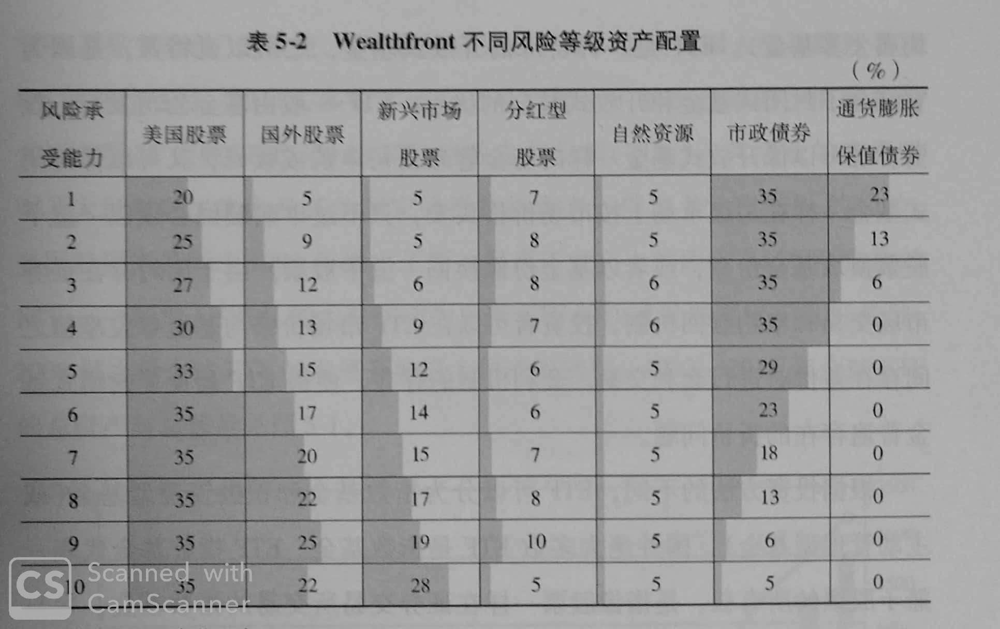

# 目录
[自序](#自序)  
[第一章 智能投顾：金融科技下的蛋](#第一章-智能投顾金融科技下的蛋)  
[第二章 美国及全球智能投顾产业发展概况](#第二章-美国及全球智能投顾产业发展概况)  
[第三章 中国智能投顾产业发展概况](#第三章-中国智能投顾产业发展概况)  
[第四章 智能投顾模式大起底](#第四章-智能投顾模式大起底)  
[第五章 智能投顾资产配置与ETF的前世今生](#第五章-智能投顾资产配置与ETF的前世今生)  
[第六章 中美智能投顾产业客群比较](#第六章-中美智能投顾产业客群比较)  
[第七章 中美智能投顾优势的对比](#第七章-中美智能投顾优势的对比)  
[第八章 智能投顾重塑中国金融微生态](#第八章-智能投顾重塑中国金融微生态)  
[第九章 智能投顾的投融资和创业](#第九章-智能投顾的投融资和创业)  
[第十章 智能投顾的风险与监管](#第十章-智能投顾的风险与监管)  
[第十一章 中国智能投顾市场展望](#第十一章-中国智能投顾市场展望)  

   
 

# 自序
## 什么是智能投顾？
> 根据个人投资者提供的风险承受水平、收益目标和风格偏好等要求，通过一系列智能算法及投资组合优化等理论模型，帮助投资者实现自动投资顾问的一种新型理财和投资管理模式。

## 智能投顾主要风险
 - 牌照与资质风险
 - 道德与信用风险
 - 大数据与画像风险
 - 低门槛与新客群风险
 - 网络安全风险

## “抢钱”条件
 - 数据样本足够的大
 - 算法足够领先
 - 反应足够敏捷

## 中国智能投顾短板
 - ETF产品不足
 - 费率太高
 - 诚信缺失
 - 买方投顾空白
 - 投机盛行
 - 投资者不理性

[前往目录](#目录) 
   
 

# 第一章 智能投顾：金融科技下的“蛋”
## 客户投资资金风险属性
 - KYC（know-your-customer）
 - 组合构建
 - 组合收益率展示
 - 风险预警提示
 - 持仓调整建议
 - 组合跟踪报告

## 智能投顾革命
 - 低成本方式对理财服务大规模复制
 - 扩大客户服务面
 - 新奇体验

## 技术前提
 - 人工智能
 - 大数据

 [前往目录](#目录) 
   
 

# 第二章 美国及全球智能投顾产业发展概况
## 知名智能投顾公司
 - Betterment
 - Wealthfront
 - Charles Schwab
 - VPAS

## 智能投顾创业平台的竞争优势
 - 低门槛
   > 比传统财富管理机构的10万美元低很多
 - 低费率
   > 复利下费率影响明显
 - 税收损失收割
   > 针对美国税法的节税筹划

[前往目录](#目录) 
   
 

# 第三章 中国智能投顾产业发展概况
## 中国智能投顾三大模式
  - 独立建议
  - 一键理财
  - 混合推荐

## 投资目的
 - 海外ETF
     > 如：弥财、蓝海智投、宜信投米
 - 国内股票
     > 如：广发证券-贝塔牛，长江证券-阿凡达狗，国泰君安-君宏理财，海通证券-e海通财
 - 公募基金 
     > 银行和基金代销产品

## 智投程度
 - 全智能
   - 有完整的用户画像、风险评测、投资组合推荐和自动再平衡的流程
   - 以用户为中心而不是以产品为中心
   - 创业门槛（人才、资源、技术）和创业成本（资金）非常高
   - 如：弥财（自动再平衡、红利再投资）、蓝海智投、宜信投米RA（用户画像、投资组合）
 
 - 内智能
   - 平台运营多年，较高品牌知名度和稳定成熟用户群
   - 以产品为中心
   - 蚂蚁财富、京东智投
  
 - 半智能
   - 银行、保险、券商、基金公司等传统金融机构
   - 摩羯智投、贝塔牛、阿凡达狗

## 进军智投
 - 券商 
     - 2016年6月 广发证券-贝塔牛，千人千面
     - 2016年10月 华泰证券收购AssetMark
     - 2016年12月 平安证券
     - 2017年4月 长江证券-阿凡达狗，利用行为数据、交易数据进行精准画像
 - 银行
     - 2016年10月 民生银行与PINTEC合作
         
 - 保险
     - 2014年12月 平安一账通
     - 2017年9月 中国太保-阿尔法保险，6组问题：基本信息，家庭结构，收入支出、资产负债、社保福利、生活习惯
 - 基金
     - 2016年8月 广发基金-基智理财（目标风险确定、组合推荐、一键购买、调仓提示、组合服务报告）
     - 2016年12月 南方基金-超级智投宝
     - 2017年6月 华夏基金+微软，研究方向包括：
         - **通过模式识别预测市场走势**
         - **基于深度学习挖掘影响市场的重要因素**
         - **基于机器学习方法论进行行业轮动**
         - **基于大数据构建金融图谱**
         - **基于社交网络与应用软件等数据识别并深度了解用户**
     - 2017年8月 汇添富基金-“添富智投”
     - 天弘基金-“风向篮子”，分析和预测资金主力动向

## 我国智投处于早期阶段
 - 不被多数投资者接受
 - 基础资源（大数据征信、优质客户群体和底层配置资产）基本掌握在传统机构手里。

## [2018智能投顾平台排行榜](http://www.enet.com.cn/article/2018/0817/A20180817052617.html)

## [中国智能投顾行业2018年8月报](http://fund.jrj.com.cn/2018/09/18153625108136.shtml)

## 金融与IT对应阶段

| Fintech阶段 | IT | 金融IT |
| :----: | :-------: | :------: |
| 1.0 | 信息化 | 金融信息化 |
| 2.0 | 互联网+ | 互联网金融|
| 3.0 | 智能+ | 智能金融 |

## 李开复：
- > “人工智能最好的应用领域之一就是金融，因为金融是唯一纯数字和钱的领域。”
- 人工智能四个条件
    1. 天文数字级别的数据量
    2. 数据量要有标注
    3. 单一领域应用
    4. 厉害的人工智能专家

[前往目录](#目录) 
   
 

# 第四章 智能投顾模式大起底
## MPT（Modern Portfolio Theory）
    现代证券投资组合理论
## Markowitz的“均值-分差”理论--《资产组合的选择》
 1. 投资者都是厌恶风险的。
 2. 所有的投资者都力图在风险既定的水平上取得最大收益。
 3. 影响投资者决策的有两个参数：期望收益率和方差。
> 理论本质
 - 在同一风险水平，投资者可以借助智能投顾获得最大回报。
 - 在同一收益水平，投资者可以选择最小的风险。

## 量化投资策略
    多因子选股策略、趋势跟踪策略、事件驱动策略、风格轮动策略、Alpha策略、无风险套利策略等。

## 收益原理
    α收益：证券选择和时机选择获得的主动收益。
    β收益：承担系统风险获得的被动收益。

## 智投流程
  1. **用户画像**:通过问卷调查评价客户的风险承受能力和投资目标。（画像会随时变动）
  2. **投资组合配置**：根据风险偏好选择个性化投资（智投平台的核心，需要大数据和算法支撑）
  3. 客户资金托管：第三方托管
  4. 执行交易：系代理客户发出交易指令
  5. **投资组合再平衡**（不宜频繁，半年或一年一次）
  6. 平台收取管理费

## 八大优势
- 私人订制：基于定制投资组合的个性化投资
- 智能调仓：随时自动再平衡
- 风险分散：借助组合投资分散风险
- 理性决策：理性投资，迅速行动
- 被动投资：省钱省心（追求长期稳定收益，而非高收益，以ETF为主要投资目标）
- 长期回报：以长期投资追求合理回报
- 买方投顾：告别单纯卖方投顾，实现共赢
  - 传统人工投顾(卖方投顾)：
    > 客户数量少、获客成本高、转化率低，客户经理能力参差不齐、知识结构单一、岗位流动性强及其他道德风险。
  - 智能投顾（买方投顾）：
    > 以客户为中心，关注资产增值，长期合作，与客户共同发展。
- 超低费率：低门槛和低费率促进普及

## 广义智能投顾
    
> **狭义智能投顾**是以大类资产配置为基础，通过以ETF为核心的公募基金作为底层资产，运用大数据和人工智能等科技金融科技来进行投资，是基于客户画像、风险评级、投资组合推荐和自动再平衡的一种智能投资模式。  

> **广义智能投顾**包括量化投资(Quantitative Investment)、社交投资(Social Investment)、智能资讯、智能投研(Intelligent Research and Development)、智能交易、智能陪伴、智能财务等细分领域

  - 量化投资
    - 借助统计学和数学
    - 通常是全自动高频交易
    - 投机性极强
    - 主动投资
    - 寻求超额收益
  - 智能投研：利用大数据和机器学习，实现数据之间的智能化关联，提高投资者工作效率和投资能力。
  - 社交投资：为用户提供模仿高手的复制交易的功能
    - eToro
    - 雪球：UGC（User Generated Content）模式
    - 牛股王:通过大数据分析和量化投资等工具吸引专业人士
    - 一起牛:基于好友关系和投资组合的移动社交投资平台  

[前往目录](#目录) 
   
 

# 第五章 智能投顾资产配置与ETF的前世今生

## Betterment
    基于13种ETF，包含6种股票指数基金，7种债券指数基金。
  - 高收益再投资型：股票90%，债券10%，高风险、高收益。推荐45岁以下。随着年龄的增长股票降至58%
  - 稳定保值型：股票40%，债券60%，长期不变。
  - 计划消费型：长期股票90%，逐步减至零
  - 退休金规划型

## Wealthfront
    11种ETF：美股、海外股票、新兴市场股票、股利股票、美债股票、新兴市场债券、美国通胀指数化证券、自然资源、房产、公司债券、市政债券。典型的基于算法的被动投资平台，目前智能化程度最高的投顾平台。

## ETF的前世今生
    ETF(Exchange Traded Funds)交易所交易性基金，一般有基金公司发行。分为指数基金（绝大多数）和主动管理型基金。
  
ETF特点:ETF的套利机会趋近于零
  - 交易透明度高
  - 每个交易日结束可以净资产价值申购和赎回

## 美国ETF巨头市场份额（2017-08-31）
1. BlackRock iShares:  40%
2. Vanguard（先锋基金）: 25%
3. State Street Global Advisors（道富）: 18%
4. The Rest: 11%

## ETF好在哪？
  - 成本低
    - 交易佣金与股票一样，很低
    - 管理费低
  - 流动性好，资金效率高
    - 15秒刷新一次报价。 
  - 透明 
    - ETF的价格和净值拟合得很好。
  - 以投资组合对冲风险

## 我国ETF数量少、规模小的原因
  - A股市场投资者结构偏重散户
  - ETF同质化程度高
  - ETF运营成本较高，很难获利

## 中国智能投顾平台的资产配置情况
|序号|平台名称|主要投资标的|
|:--:|:--:|:----|
|1|弥财|海外ETF|
|2|蓝海智投|海外ETF、国内ETF、QDII|
|3|财鲸智投|海外股票、ETF|
|4|投米RA|海外ETF|
|5|拿铁智投|国内外股票、债券、黄金、货币|
|6|璇玑|国内外股票、债券、黄金|
|7|理财魔方|公募基金|
|8|蚂蚁财富|股票、基金、黄金|
|9|京东智投|*国内投资*分固定收益类、现金管理类、私募股权类和私募基金类 *海外投资*包括境外股票、房地产信托投资基金、房地产投资基金、 对冲基金、债券等|
|10|聚爱财Plus|P2P网贷、货币基金、A股、债券、期权|
|11|钱景私人理财|公募基金|
|12|资配易|A股股票|
|13|胜算在握|A股股票|
|14|慧理财|A股股票|
|15|微量网|A股股票|
|16|百度股市通|A股股票|
|17|摩羯智投 （招商银行）|公募基金|
|18|财智机器人 （浦发银行）|公募基金、贵金属|
|19|兴业智投 （兴业银行）|公募基金|
|20|阿尔法智投 （江苏银行）|理财、基金、保险|
|21|贝塔 （广发证券）|A股股票、ETF|
|22|阿凡达狗 （长江证券）|A股股票|
|23|海通证券|A股股票|
|24|平安证券|A股股票、固定收益、黄金|

[前往目录](#目录) 
   
 

# 第六章 中美智能投顾产业客群比较
## 美国智能投顾客群分析
|客户群|家庭金融资产规模|人数|投顾服务状况|
|:--:|:--:|:--:|:--:|
|超高净值|1000万美元以上|52万|有稳定投顾服务|
|高净值|100万~1000万美元|1200万|有稳定投顾服务|
|中等净值|25万~100万美元|3400万|有投顾服务 但不稳定|
|低净值|25万美元以下|2.68亿|无投顾服务|

### 智能投顾的主要客户群：
    家庭金融资产规模100万美元以下，没有稳定投顾服务或无投顾服务的人。

## 中国智投市场
    中国中产达2.25亿，是一个百万亿级别的市场。但仅有12%投资者使用投资顾问。全球为64%，美国为67%。中国投顾缺口巨大。80后、90后新中产将成为智能投顾最大客群。

[前往目录](#目录) 
   
 

# 第七章 中美智能投顾优势的对比
## 美国智能投顾产业优势
- 传统投资投顾产业发达，买方投顾非常普遍
  - 经历人工投顾-折扣经纪商-数字投顾-智能投顾，完整的发展过程
  - 相对理性和健康的理财习惯
  - 庞大的财富管理市场和资产规模
- 中国几乎没有买方投顾，几乎都是卖方投顾。美国更多的是买方投顾
- 传统资产管理机构规模巨大、实力雄厚
- ETF品类多，数量大、价格低、流动性好，基于ETF设计投资组合非常便利
  - ETF是智能投顾业务的一个重要基础产品，是被动投资理念得以实施的关键所在
- 美国民众的长期投资习惯和节税意识
- 美国在人工智能上拥有先发优势

## 美国智能投顾产业的劣势
- 传统投顾过于强大，智能投顾后劲不足
- 财富越来越向富人集中，中产阶层财富正在下移化

## 中国智能投顾的优势
- 个人理财规模和高净值人群数量巨大，增长迅猛
  - 以80、90后为代表的新中产更热爱人工智能等新事物
- 国人资产配比严重不合理，面临资产重新配置需求
  - 房地产比例过高，且受到调控。
- 高净值人群对海外资产配置的热情日益高涨
- 移动支付的高度普及和获客场景便利
- [2018年中国ETF规模增加](https://xueqiu.com/7351287878/118987513)

<b>2004~2018年中国ETF规模</b>

 
 

<b>2004~2018年中国ETF发行规模</b>

## 中国发展智能投顾的劣势
- 金融市场总体发展落后，金融产品少，投资组合设计受限。
  - ETF数量少，规模小，不能有效化解投资风险
- 中国投资者大多喜欢短期主动出击，不喜欢被动和长期投资
  - **机构投资者借助量化投资等各种金融工具，通过主动投资获得的收益要远高于被动投资，而长期投资可能亏损**
- 法律与资质上的障碍
  - 智能投顾与传统投资顾问一样属于《证券法》证券投资咨询的概念，受到《证券投资顾问业务暂行规定》《证券、期货投资咨询管理暂行办法》等法规的约束，**仅被允许基于智能算法的资产配置建议，不能直接自动化交易，因而无法从事资产管理业务**。完整的智能投顾服务所包含的诸如客户实际投资跟踪再平衡的环节，无法有效展开
  - **智能投顾平台只要在网上卖基金，就必须取得基金销售业务资格或牌照**，否则就是违法

[前往目录](#目录) 
   
 

# 第八章 智能投顾重塑中国金融微生态
## 智能投顾是中国银行业务转型的利器
- 缺乏足够强大的改革动力
- 传统理财模式落后，获客、销售成本高，利润单一（销售佣金）。
- 受到互联网金融的冲击
- 银行出击智能投顾的优势：
    - 有政府背书的信用和相关牌照优势
    - 历史大数据
    - 大量优质客户
- 银行出击智能投顾核心驱动
  - 借助智能投顾，提高财富管理规模和水平
  - 改变传统以卖方投顾为主的财富管理模式，降低投顾成本，提高利润
  - 应对越来越强大的科技金融平台的竞争

## 券商开展智能投顾业务具有天然优势
- 券商业务：
    - **经纪业务**
    - 投资银行业务
    - 资产管理业务
    - 证券自营业务
    - 投资咨询业务
- 券商开展智能投顾业务优势
    - 代销牌照包含所以金融产品，有大量交易数据，用户画像精准。
    - 客户风险偏好相对较高，减低投资风险意愿较强。
    - 券商APP普及

## 智能投顾将大力推动保险业的业务创新
- 保险业四大困境
  - 利润巨额下降
    - 资产投资率下降
    - 运营成本上升 
  - 线上流量越来越贵
  - 卖方销售模式
  - 资产配置压力

- 保险核心业务
  - 保险负债（保单业务）
  - 保险投资（资产管理）

- 智能投顾在保险业的创新
  - 评价客户风险，提供个性化的解决方案
  - 基于图像识别检测技术、人工智能的汽车智能定损
  - 医保赔付金额确定

- 智能投顾对普通投资者的好处
  - **透明度提高**，降低理财心里门槛
  - **低费率**，降低投资者理财成本
  - **投资组合和再平衡**，降低理财难度
  - 改变投资者偏重**主动投资**和**短期投机**的习惯
     - 智能投顾的精髓：**分散**和**再平衡**

## 智能投顾的本土化挑战
- 国内资产配置难，管理费相对较高。
  - 国内金融产品品类缺乏、数量稀少
  - 无奈只能用主动管理型基金替代被动ETF
  - 主动管理型基金的申购赎回费用和管理费远比ETF高
  - “T+1”的申购赎回机制会面临推迟赎回的风险，对流动性造成影响
- 海外资产配置受限
  - 2017年2月1日，内地客户香港开户门槛从5万提高到500万。监管日益严格
- 买方投顾模式的建立和客户持续信任不足
  - 智能投顾的透明性：**投资标的**和**动态调仓**的透明
- 投资者教育不足，刚性兑付难以打破
  刚性兑付成为以浮动型收益为特征的智能投顾在中国发展的巨大障碍。

[前往目录](#目录) 
   
 

# 第九章 智能投顾的投融资和创业
## 2B还是2C
- 2C：为用户提供服务
  - 美国投资者理性，没有牌照限制，创业型2C平台能够快速发展起来
  - 中国投资理财观念落后、投资者理性欠缺、传统投顾市场不够发达、牌照管理等因素导致2C智能投顾平台创业艰难
  - 流程：平台搭建、产品研发、智能投顾引擎开发、市场营销、获客、投资组合配置、交易执行、再平衡、市场监控、政策合规和政府公关等
  - 难点
    - 获客难，没有品牌知名度和美誉度
    - 缺少大数据信征、投资组合设计能力
    - 资金不足
    - 牌照，需要**投资顾问**和**资产管理**牌照。
- 2B：为金融机构提供智能投顾解决方案
  - 考虑：
    - 没有金融牌照
    - 产品太超前或太后台
    - 综合实力不够强
    - 缺乏客户资源和大数据积累，无法独立设计投资组合
  - 好处
    - 专业定位信息中介，不用担心牌照
    - 可以借船出海
    - 不用直接面对用户
- 2C转2B
  - 为传统金融机构或大型互联网金融平台提供后台技术服务和智能投顾解决方案
  - 与传统金融机构或大型互联网金融平台合作联手推出共享智能投顾平台
  - 2B与2C比行，考2B业务的盈利补贴2C业务

## 专注细分领域创业
- 按平台功能划分
- 按客户身份进行细分

[前往目录](#目录) 
   
 

# 第十章 智能投顾的风险与监管
## 一般风险
- 牌照与资质风险
  - 需要投资顾问牌照和互联网基金销售牌照
  - 我国互联网金融领域主要牌照：

|序号|牌照名称|审批机构|
|:--:|:--:|:--:|
|1|民营银行|银监会|
|2|第三方支付|中国人民银行|
|3|消费金融|银监会|
|4|互联网保险|保监会|
|5|互联网基金销售|证监会|
|6|互联网信贷|银监会|
|7|互联网小贷|省级政府主管部门 （金融办或相关机构）|
|8|股权众筹|证监会|
|9|互联网证券|证监会|
|10|个人信征|中国人民银行|

- 道德与信用风险
  - 大数据、云计算、人工智能缺一不可，其中算法和再平衡能力是关键
- 大数据与画像风险
  - 缺少用户数据累积，用户画像失真
- 低门槛与新客群风险
  - 引入了高风险客户群体（类似次贷客户）
- 网络安全风险
  - 攻击目标：客户数据、算法、交易执行功能、客户登录界面
  - 降低风险关键：IT技术和风控技术

[前往目录](#目录) 
   
 

# 第十一章 中国智能投顾市场展望
## 中国智能投顾市场潜力巨大，前景广阔
- 中国资产管理规模告诉增长，个人财富管理需求旺盛
> 预计2022年我国资产管理业务总规模将达到252万亿。
- 中国高净值人群财富规模惊人且钟情智能投顾
- 三维立体投顾市场想象空间巨大
  - 智能投顾改变中国
    - 变卖方投顾为买方投顾
    - 变狂热投机为理性投资
    - 变短期投资为长期投资
    - 变主动投资为被动投资
    - 变单一投资为组合投资
    - 变固定资产为金融资产
- 只有智能投顾才能推动中国资产管理市场的创新和发展

## 中国智能投顾产业未来发展趋势
- 银行和证券等传统金融机构未来将继续引领智能投顾
  - 银行优势：
    - 高净值客户群
    - 公募基金代售经验
    - 资产组合能力
  - 券商优势：
    - 用户基础和渠道优势，尤其互联网券商，客户群与智能投顾潜在客户群高度重合。
    - 稳定的APP用户，积累了大量客户基础、流量入口和大数据
  
- 以追求β收益为目的的被动投资将逐渐受追捧
- 人工投顾数量可能不降反增，投资顾问将成为自由职业
- 基于人工智能的ETF将大大增加
- 理财市场的投机心态有望逐渐变淡
- 固定资质将面向金融资产大转移
- 更多2C将转向2B模式或“2C+2B”模式
- 中国不可能复制美国的智能投顾模式
- 中国没必要复制美国的智能投顾模式
  - 中国发达的移动支付为智能投顾打下了坚实的基础
  - 中国人的乐观心态和对人工智能的大胆尝鲜是智能投顾兴起的重要推动力。
- 中国将发展出一套不同于美国的智能投顾模式
  - 一站式资产管理模式
  - 以公募基金为主导的资产配置模式
    - 公募基金比较透明、完善的信息披露机制，容易穿透到基础资产，标准化程度高，认购起点低，流动性好，在资产组合再平衡方面表现较优。 
  - 适度主动管理的智能投顾模式
    - A股散户主导，完全由投顾机器人控制，在极端情况下可能血本无归。
  - 多元交叉的智投服务和盈利模式

[前往目录](#目录)
 
 
